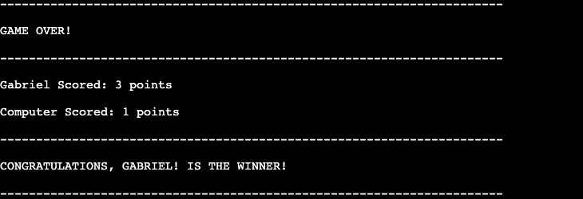

# Bombing Blasting Battleships
---

## Features
---
### Existing Features

### Features Left to Implement

## Languages and Resources
---

* [Python](https://www.python.org/) - Language used to write the terminal-based game.
* [Code Institute Template P3](https://github.com/Code-Institute-Org/p3-template) - The template used to build the site.
* [HTML5](https://html.spec.whatwg.org/multipage/) - provided by Code Institute. 
* [JavaScript](https://www.w3.org/TR/css-2022/)  - provided by Code Institute. 
* [GitHub](https://github.com/) - Repository for the site’s code.
* [Codeanywhere](https://www.codecademy.com/)  - IDE used to write the code.
* [Am I Responsive](https://ui.dev/amiresponsive) - To test the responsiveness of the page.
* [Heroku](https://www.heroku.com/home) - To deploy the project.

## Testing
---

### Validator Testing

### Bugs

#### Fixed Bugs
#### Unfixed Bugs

## Deployment
---

## Credits
---

### Content
### Media

