# Bombing Blasting Battleships - Terminal-based Game

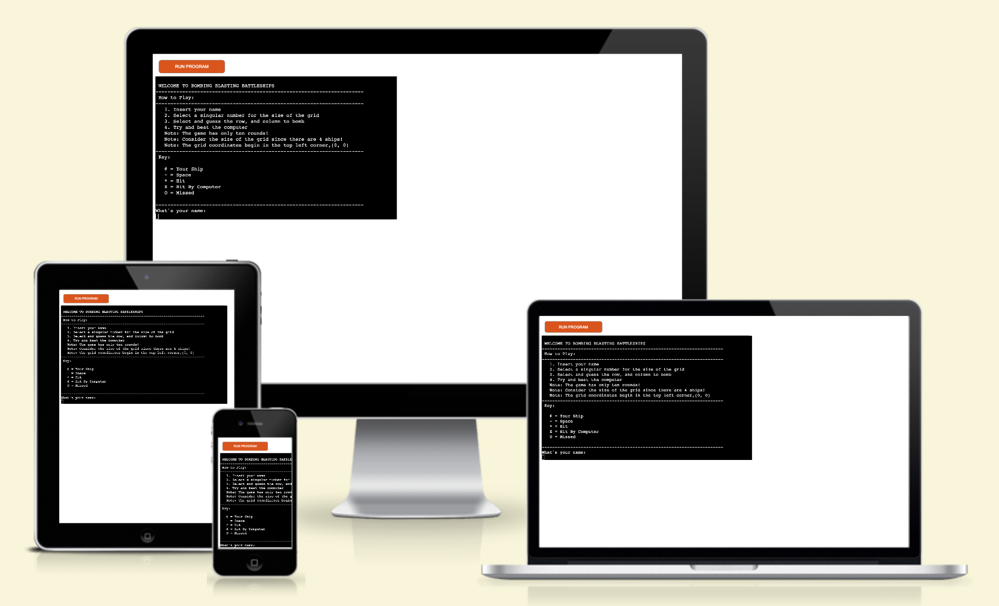
This responsive page is designed for people wishing to play a simple interactive game to pass the time and can be viewed on various devices. 

[Here is the live version of Bombing Blasting Battleships ](https://bombing-blasting-battleships-f95b679c02b6.herokuapp.com/)

### About the page

Bombing Blasting Battleships is a Python terminal-based game, which runs in the Code Institute GitHub project three template and is deployed on Heroku. Bombing Blasting Battleships is a game based on the well-known commonly played battleships game however, instead of the board game itself the game is played on a digital format such as this page. 

### Bombing Blasting Battleships Goals

### Site Owner’s Goals

The site owner wishes to deliver a battleship game that can be enjoyable and challenging for the user whilst also staying interactive. The owner wishes for more people to take part and continue to play.

### User Goals
The external user of this application wishes to be entertained with an enjoyable and challenging game. The user wishes to pass the time and keep entertained.  

Therefore to achieve the user's goals as well as the site owner's goals, numerous features were created to help deliver the game the user wishes to play. The objective of the game is to play against the computer to sink the computer ships which the user has no idea where they are placed, you must sink as many of the computer's ships as possible and hope that none of your  four ships are hit within the ten rounds of the game. 

## Features

The overall game structure is a welcome statement, followed by a ‘how to play’ section and a ‘key’ section. Then after this, there are two input requirements: the user's name and the grid size the user would like to play with. If both inputs are filled in with valid data the game will begin. From the data provided, it will display the game's initial boards, that being the player's board and the computer's board. Followed by this, the game will start the first round, with two more input fields, wanting valid coordinates on where the player wishes to strike on the computer's board. By providing valid values the computer will place its guess automatically. After these events, the board will show the impact points on the boards. Then this process begins again with round two. There are ten rounds of the game and each ship sunk is a point for the player or the computer. Once the ten rounds have been guessed/ played the score will be revealed and show the user who won marking the end of the game. 

### Existing Features

### Welcome Section

Within the welcome section, there are four features, the title, how to play, the key, and the initial inputs.

* The title: The title is underlined and is completely in uppercase, this is to draw the attention of the user to the name of the game. What this does is it informs the user what game they are playing but also provides the game with a memorable name, by doing this the user can refer future users to play the game by referencing the titled name of ‘Bombing Blasting Battleships’.
* How to play: The 'How to play' section was added to inform the users of the rules as well as instruct them on the structure of the game itself. Therefore this provides the users with clarity of how the game is played and notes to be taken before playing to achieve an enjoyable game of battleships.
* Key: The 'key' was created for the basic purpose of informing the user with clear labels on what the symbols of the game mean. This provides the user with clear insight into the game and allows the user to fully grasp the intentions of the symbols used in the game.
* Initial Inputs: There are two inputs in the welcome section; the name input and the grid size input. Firstly the name input is a great feature for the user to interact with since this allows the user to use their name and the game becomes more personal. Therefore this provides the user with an enjoyable experience as the game encourages the user to be more involved. Secondly, the grid size input is a great input as it allows the user to decide on the way they would like to play the game and makes the game more interactive. By providing this input allows the user to also decide on the level of complexity at which they wish to play the game. Thus this provides the user with a challenging and interactive experience.

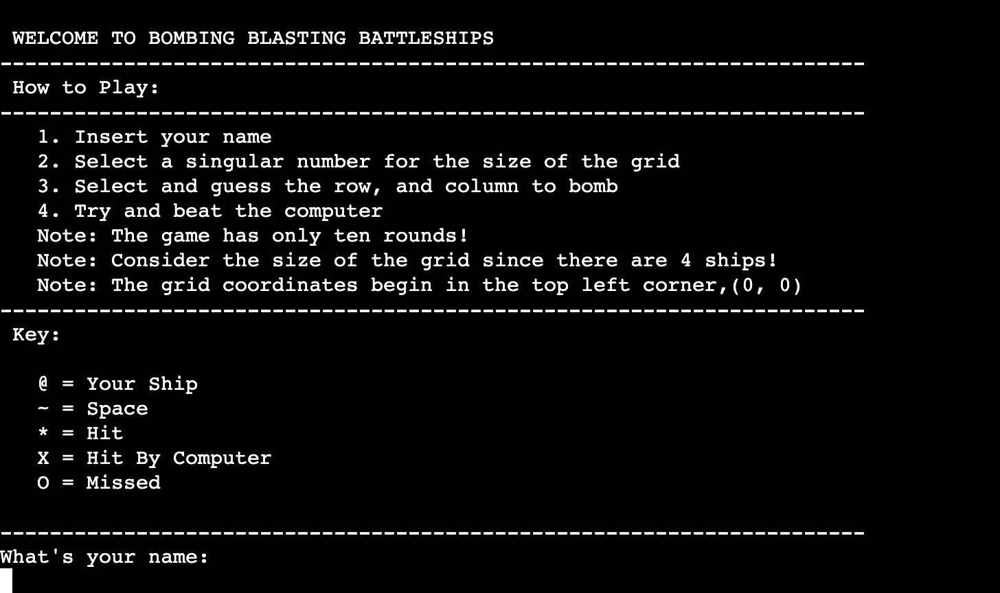

Another note to add is that the grid value input has built-in value errors, therefore the only values that can be inserted are those that are above three and are whole numbers, anything else will result in a value error and prompt the user to try again. Having this feature it allows for any mistake that the user might make. 

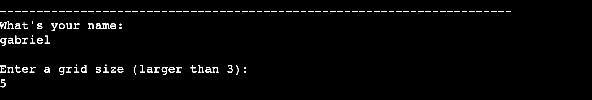

### Initial Boards

Once the grid value of input has been filled in correctly the game produces the initial boards; the user's board and the computer's board. Again with the use of the inputted name, the board becomes personalized. Another feature here is that the game randomly picks places on the grid and displays the user's four ships with a ‘@’ symbol that allows the user to clearly identify where their ships are located. In future features perhaps the user could place their ships themselves (more in features to implement). There is a horizon dashed line dividing the two boards this also adds to the user experience of clearly identifying which board is their own and which is the computer's. The computer's board is left clear as it should be, as this would take the objective of the game away.

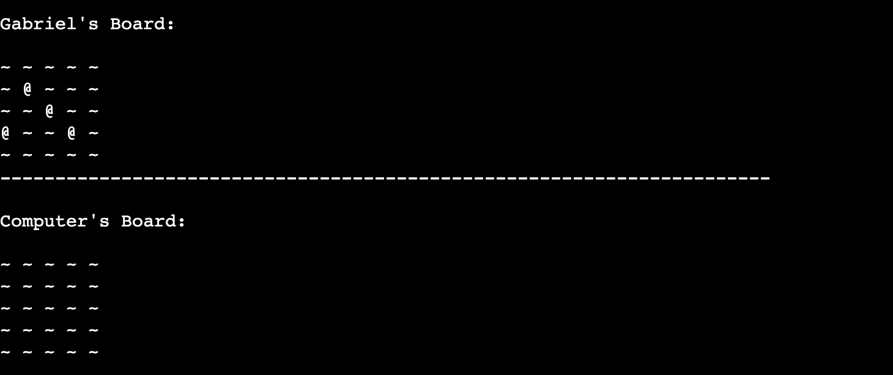

### Rounds

Along with the initial boards, the first round is printed into the game. In the round section, there are multiple features all with their own purpose. The first is the user's turn/go, correctly labeled with the name of the user just like the board, it makes the game more personalized. Then there is the guess row input that allows the user to enter a guess value. With the instruction of the input field, in brackets, there are the numbers zero to four. By doing this it allows the user to identify which numbers will be considered correct, as it can be complicated due to the fact that Python starts indexing at zero, which makes it the first value. Therefore there were alterations made to the code so any desired value inserted into the grid size input field so that the values produced in the brackets will be zero to the desired number minus one. Once the valid input has been submitted it will trigger the next input field, that is the guess col field. Which takes the same principles as the first input. Like the grid size input field, these two input fields that have a similar response to invalid data. Once these inputs have been submitted the game will produce a valid response in this case it will produce ‘You missed’. It is outlined in two small dashed lines to draw the attention of the user. In this example, the response is ‘You missed!’However, there are two more responses; in the case that the user hits the computer ship it will produce the response ‘Congratulations, you sank the computer's ship’ and in the case that the user enters data which they have submitted before, the response message produced would be ‘Oh no! You guessed these values before’. This again means that the game is equipped to handle any inputted data. 

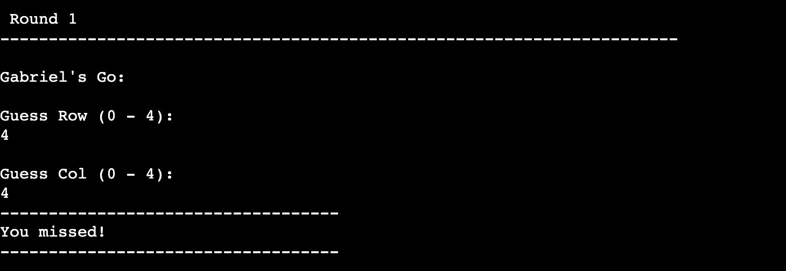

When the final guess input field has been submitted it also prints the boards again to show the user where their guess has impacted the opponent's board, since it was a missed strike the ‘~’ is replaced with a ‘O’. Like the different outcomes of the guesses, the boards depending on the value guess will change too, such as if a ship  was sunken it would change the space with the ‘*’ symbol this allows the user to have a visual of what is happening in the game. Thus allowing the user to understand the structure of the game which allows them to have a more enjoyable experience. 

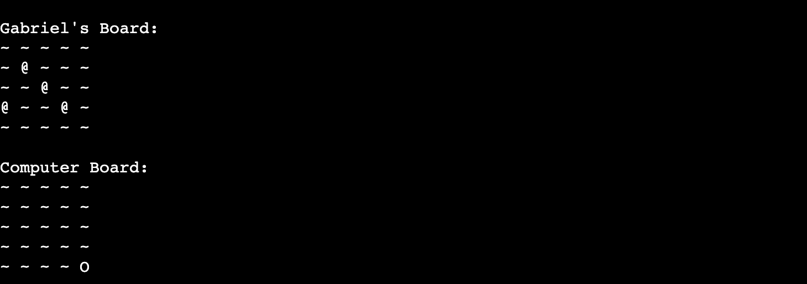

Along with the printed boards, the computer's go/turn will appear and it will show a response similar to that of the player. In this case, the computer missed, but like the player’s board if the computer was able to hit the player’s ship it would display the comment ‘Oh no! The computer sank your ship!’ or ‘Oh lucky the computer already guessed this!.’. Again this makes the game equipped with the ability to handle any input the computer might make either. Along with the computer's go/turn only the player’s board is printed to see the impacted point on the player’s board. Allowing the user to see what happens which provides the user with an informative experience. 

This whole process of the round starts again as round 2 would be printed after this. This repeats for ten rounds. Each round title increases the number and the board is updated with each hit and missed strike made by the user and computer. This again provides the user with clarity of where they are in the game and allows them to look back at the game to what happened when and where. 

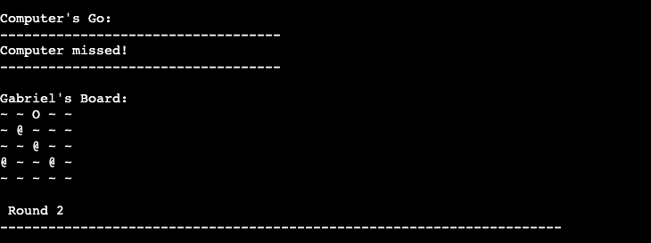

Another feature added to prevent an endless loop was that of invalid attempts on the guess input fields. When the user enters invalid data into the guess inputs three times, the game will end. This prevents an endless loop and asks the user to enter valid points or the game will end; this creates an efficient way of playing the game.

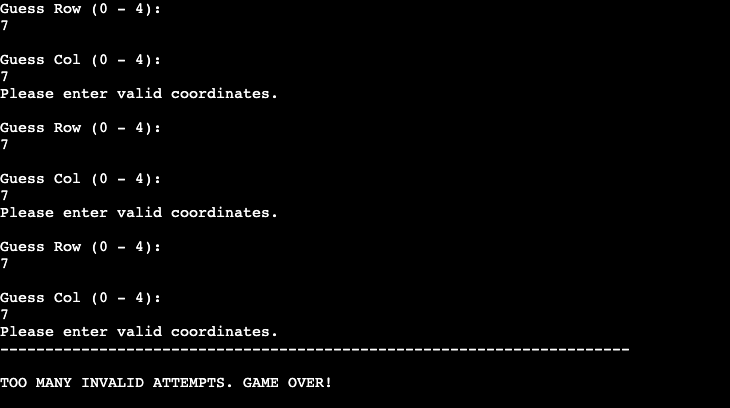

### End result of boards

As mentioned by the end of the game the boards will look relatively like this impacted by what the user and computer have guessed over the rounds of the game. This allows the user to have a clear visual of the game thus making the game more enjoyable. As well as adaptive to a more visual learner/ thinker. 

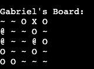
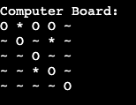

### End of the Game

Once the ten rounds have been completed the board will mark the end of the game. Like the title the ‘Game Over’ wording is in all uppercase letters to draw the attention of the user to clarify the end of the game, to create a clear and informative environment. Under this the score of the computer and player will be shown with every ship hit the player and the computer receive one point, in this case, the player scored three and the computer scored one. Therefore the player wins the game and that is clearly marked underneath with a response. Again like the rest of the code, the game is equipped with a response for a lost game as well as a tie. Again this feature allows the game to be equipped with any outcome, therefore creating a perfectly organized game. 

### Features Left to Implement

There are a few features that could be added to this terminal-based game here is a list of a few:

- The game could be imported/adapted to a site for either a simple gaming website or be helpful for a kid's math game for children to learn coordinates in a fun and interactive way.
- Another future feature could be that the user could place their own ships. It could work similarly to the guess input fields but instead of striking them, it could be placing the ships.
- A feature that would also advance the game would be the element of having an input field to decide how many ships will be placed on the board or that based on the grid size the user has inputted that 10% of that value would be ships.
- To add onto the grid size feature since if the user enters a larger number ten rounds of the game wouldn't be enough therefore this value could increase or decrease based on the size entered by the user.
- Another feature is that if the user manages to hit all four  of the computer's ships before the ten rounds are up the game could end. 
- More features that could be added would be the fact that the game could have a returning feature therefore the user will be able to play again and again, with the data of their scoring saved onto a database. 

## Languages and Resources

* [Python](https://www.python.org/) - The language used to write the terminal-based game.
* [Code Institute Template P3](https://github.com/Code-Institute-Org/p3-template) - The template used to build the site.
* [HTML5](https://html.spec.whatwg.org/multipage/) - The language provided by the Code Institute template. 
* [JavaScript](https://www.w3.org/TR/css-2022/)  - The language provided by the Code Institute template.  
* [GitHub](https://github.com/) - Repository for the site’s code.
* [Codeanywhere](https://www.codecademy.com/)  - The IDE used to write the code.
* [Am I Responsive](https://ui.dev/amiresponsive) - A site used to test the responsiveness of the page.
* [Heroku](https://www.heroku.com/home) - Used to deploy the site.

## Testing

The page has been fully tested in two major ways manually and using the build-in checks and Python validator.

### Manual Testing

* The features on the page include the run program button and the terminal-based game itself, both are very responsive and interactive which work perfectly.
* With the terminal-based game the following has been checked:
    - Valid inputs: All input features in the game have been fully tested. Starting with name input when a name is entered all future printed iterations are correct and capitalize the name throughout the game, this was tested by entering a lowercase name.
    - Secondly, the grid input has been fully tested, it has been checked that any number equalling three or lower does not get accepted and encourages the user to enter a valid number, and all non-integer strings are not accepted either this was tested by placing incorrect values into this input. It was also tested that the integer inputted does print the desired number of spaces on the board.
    - In the same way the guess row and guess col inputs have been tested, each does not accept any non-integer values and requires the user to enter a number between zero and the desired number of spaces minus one. Any other values outside this range receive an invalid attempt and once this happens three times the game ends. All these features have been tested by inserting incorrect data into the inputs.
    - The feature of submitting the same values into the guess inputs has also been tested and it does return the statement  that the user has already guessed that position. In addition to this, it has been tested that the inputted coordinates do correlate to those on the boards.
    - Overall all the inputted sections of code have been fully tested and all respond to the kind of data a user might insert.
    - The game has been played numerous times and always delivers the correct score and result of who won correctly too.

* The game has also undergone input from the built-in suggestion of what the IDE ‘Codeanywhere’ suggests, particularly to the display and the organization of the code. 

### Validator Testing
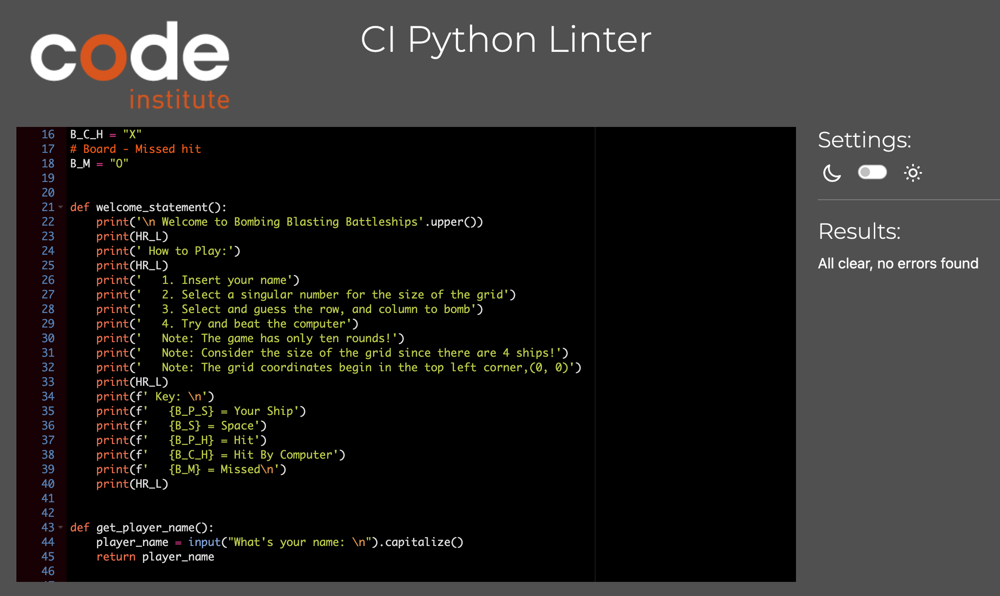

* The Bombing Blasting Battleships page has no errors and when passing through the official [CI Python Linter (validator)](https://pep8ci.herokuapp.com/) the result returns ‘All clear, no errors found’.

### Bugs

#### Fixed Bugs

In the context of bugs there were a few minor simple fixes, however, there were two major bugs in the development of the code:

* First was in the context of when the computer would randomly choose its grid values. The values the computer makes come from a random number function which generates random numbers between zero and the desired grid size. The computer uses this function for its entries, however, upon first testing, the game would often crash after the user entered their values, however, it wasn’t consistent because offer or not the player could go as far as the sixth round and other times it would be hard to get to round two without the game crashing. Therefore, with an investigation, it was discovered that, since the indexing of the grid begins at zero in Python it considers zero as the first value. Thus the random number function was producing numbers between zero and the inputted desired grid size, which by doing so made the computer enter grid coordinates that were considered out of range. To fix this the function was adjusted so the range would be between zero and the desired number minus one. 

* The Second major bug was the fact that in the early stages of the site, the player would be able to see where the ships were placed on the computer's board. This completely took away the whole point of the game since the user would be able to win within four rounds and cheat because the ships were on display. Therefore to fix this problem the solution was to have three boards, one for the player and two for the computer. The first computer board would be the underground board where the user's actions would impact it, and the other would be a display board. A board that would only display the hit points and points which the player has interacted with. Thus this was created by creating a third variable labeled hidden and making sure that the actual computer board was being updated and updating the display board with the correct values.

#### Unfixed Bugs

* At this current point there are NO bugs that were left unfixed. 

## Deployment

The site was deployed to Heroku. The steps to deploy are as follows:
* On the Heroku dashboard click ‘New’, and continue to ‘Create new app’
* Create a name for your deployed project and select the region of the world you reside in.
* From here navigate to the settings tab of the project, continue to the ‘Config Vars’ section, and click ‘Reveal Config Vars.
* Within the ‘KEY’ input insert ‘PORT' and within the ‘VALUE’ input insert ‘8000’ and continue to click ‘Add’.
* After this continue to the Buildpacks section and click ‘Add buildpack’. 
* Here select ‘python’ and click ‘Add Buildpack’ again. Repeat this step but instead of ‘python’ click on ‘nodejs’. Once completed check that buildpack ‘python’ is ABOVE that of ‘nodejs’.
* From here return to the deploy tab of the project, and go to Deployment method, here select GitHub (or the service your repo is saved to).
* Once connected within the input labeled ‘repo-name’ insert the correct name of the repo saved on your GitHub account.
* Then from here click ‘Connect’.
* Finally in the Manual deploy section click the ‘Deploy Branch’ button from here the code will take some time to deploy once this is done, click on the button labeled ‘View’ to see your LIVE project deployed. 

You can view my live site of Bombing Blasting Battleships [here.](https://bombing-blasting-battleships-f95b679c02b6.herokuapp.com/)

## Credits

### Content
* The code template for the site was provided by [Code Institute](https://github.com/Code-Institute-Org/p3-template)
* The idea of the game comes from the common game of [Battleships](https://en.wikipedia.org/wiki/Battleship_(game))
* Inspiration for the basic look and functionality was influenced by [ULTIMATE BATTLESHIPS](https://p3-battleships.herokuapp.com/)
* The project [Love Sandwiches](https://github.com/Code-Institute-Solutions/love-sandwiches-p5-sourcecode) was a huge help in understanding the use of functions and importation into the Python file. As well as the basic structure of code.
* The YouTube channel [Programming with Mosh](https://www.youtube.com/@programmingwithmosh/featured) and a few videos helped the process of overcoming more complex areas of the site such as placing the ships function.
* The Youtube video [Python Tutorial: Generate Random Numbers and Data Using the Random Module](https://www.youtube.com/watch?v=KzqSDvzOFNA&t=531s) by Corey Schafer was a huge help in concern to import and generating random numbers by importing 'random'.

### Media
* No media files were used in the creation of this site.

